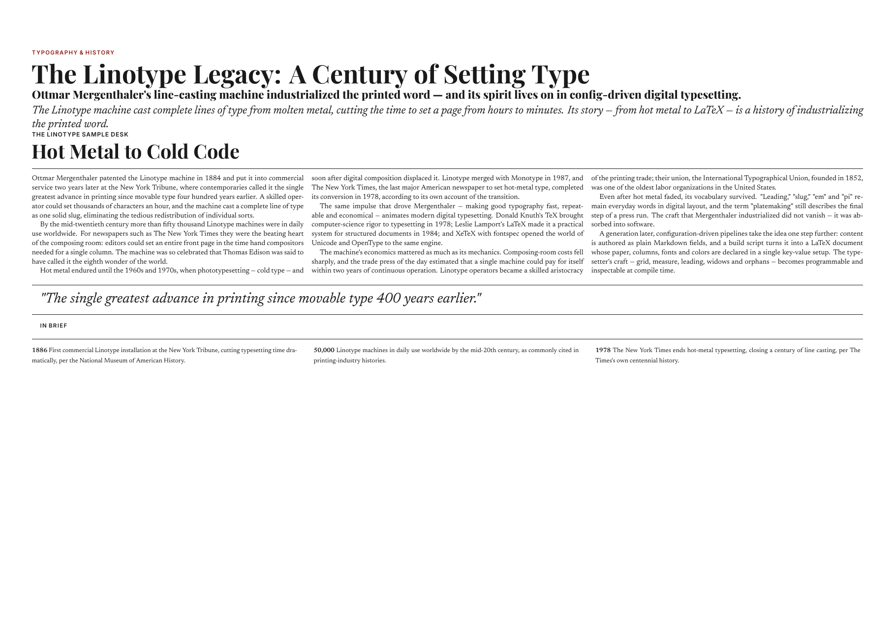
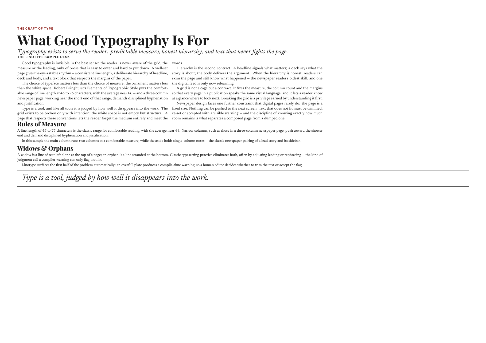

<div align="center">

# 🗞️ Linotype

**AI 时代的配置驱动通用排版引擎（LaTeX）**

把 Markdown 内容排版成印刷级多栏 PDF——带编译期溢出检测。

`plates/*.md` → `build.py` → `xelatex` → **PDF**

[快速开始](#快速开始) · [内容格式](#内容格式) · [配置系统](#配置系统) · [QA 管线](#qa-管线) · [架构文档](docs/ARCHITECTURE.md) · [开发历程](docs/DEVELOPMENT-HISTORY.md) · [English README](README.md)

</div>

---

## 这是什么

Linotype 是一个**配置驱动的通用 LaTeX 排版引擎**，不绑定任何报纸或出版物。任意一组 Markdown 版文件（plates），配上纸张尺寸、栏数、字体与配色，即可产出印刷级 PDF。

核心差异化能力是**固定版心布局**：内容排入固定版心（plate）与固定栏网，**超高不推页**——溢出以**编译期警告**（`Overfull plate: content Xpt > contentH Ypt`）报出，版面保持稳定。

> 调研过的成熟 LaTeX 报纸项目（LiX、modernnewspaper、papertex、CTAN `newspaper`）都会在内容超高时推页或静默溢出。据我们所知，Linotype 是唯一一个既稳住版面、又在编译期精确报告超了多少的方案。

## 特性

- **配置驱动** — 纸张（A3/A4/Letter）× 横竖版 × 栏数（2–4）× 每页版数（1/2）× 字体 × 配色 × 主题，全部收敛在一条 `\linotypesetup` 键值里
- **Autofit 自动版面调整（默认开启）** — 内容超高/太空时自动缩放大字号（8.5–11pt）与栏数（2–4）直至收敛，零手工调参。**有边界**：纸张是硬约束绝不动；欠满不强行填满
- **主题系统** — `newspaper`（衬线+深红）/ `magazine`（Charter+深蓝）/ `brief`（单色）；显式字体/颜色永远优先于主题
- **Markdown 字段化** — plates 是带 `KICKER:`/`HEADLINE:`/`BODY:` 字段标签的纯文本；无 HTML、无 CSS、无 DOM
- **图片支持** — `IMAGE:`/`IMAGEWIDTH:`/`IMAGECAPTION:` 字段渲染为 `\photo`；图片高度精确计入溢出检测（超大图 → `Overfull plate`，绝不静默跳过）
- **编译期溢出检测** — `Overfull plate` 警告由引擎自身发出；欠满（内容偏少）被过滤为非缺陷
- **视觉验收闭环**（`--visual`）— 渲染 PDF → 像素级列空隙诊断 → 修复建议（借鉴 PaperFit）
- **无空白首页** — 溢出用 `vsplit` 截断兜底，绝不把版推到下一页
- **字体走 fontconfig** — 任意已装字体族名即用（`Newsreader`/`Playfair Display`/`Inter` 开箱即用，`bodyfont=...` 可换）
- **引擎纪律** — 只用 XeLaTeX，pdfLaTeX 在加载时被类拒绝（fontspec 依赖）
- **QA 管线** — 编译警告 + `pdfcheck.py`（PDF 结构/字体/页数）+ 可选 `pixelcheck.py`（像素级列空隙分析）

## 快速开始

```bash
# 1. 编写内容 — 每版一个 Markdown 文件（参考 examples/plates/）
ls examples/plates/
#   p1.md  p2.md

# 2. 由 plates 生成 LaTeX（默认 autofit：自动编译迭代直至版面收敛）
python3 build.py examples/plates/ examples/sample.tex \
    --docopts "paper=a3,landscape,columns=3,plates=1"
#    → 收敛后直接产出 sample.tex + sample.pdf，无需手动编译
#    → 关闭自动调整（纯生成，需手动 xelatex）: 加 --no-autofit

# 3. 后处理 QA
python3 pdfcheck.py examples/sample.pdf --log examples/sample.log \
    --paper a3 --landscape --pages 2
```

示例输出（2 页、A3 横版、3 栏、0 警告）：

| 第 1 版 — 等宽多栏 | 第 2 版 — 主栏+侧栏 |
|:---:|:---:|
|  |  |

## 工作原理

```
plates/*.md（字段化内容）              ← 唯一事实源
      │  build.py（内容管线）
      ▼
      .tex  （linotype.cls 文档类）
      │  xelatex
      ▼
      PDF  +  .log
      │
      ├─ LaTeX 原生警告: Overfull plate / Underfull（已过滤）
      ├─ pdfcheck.py: MediaBox / 字体嵌入 / 页数 / 日志扫描
      └─ pixelcheck.py（可选）: 渲染 PNG 的列空隙分析
```

`linotype.cls` 提供版式原子：`masthead`、`sectionstrip`、`kicker`、`headline`、`subheadline`、`expandedtitle`（跨栏标题）、`deck`、`byline`、`storycolumns[N]`、`pullquote`、`inbrief`、`mainaside`（主栏 2 栏 + 侧栏 1 栏），以及强制固定版心的 `plate` 容器。

## 内容格式

每版一个 `plates/pN.md`，使用**字段标签**（不是 Markdown 标题）：

```markdown
LAYOUT: main-aside        # 可选: ''（等宽多栏，默认）| main-aside
COLUMNS: 3                # 可选: 版独立栏数
EXPANDEDTITLE: 跨栏标题    # 可选: 全版宽标题，打破所有栏
IMAGE: img.jpg            # 可选: 图片路径（相对 plates/ 或绝对）
IMAGEWIDTH: 1.0           # 可选: 图宽占版宽比例 0-1（默认 1.0 全版宽）
IMAGECAPTION: 图注        # 可选
KICKER: 眉题
HEADLINE: 主标题
SUBHEADLINE: 副标题        # 可选
DECK: 导语
BYLINE: 署名
BODY:                     # 正文段，段间空行
第一段...
第二段...
STORY-B: 侧栏故事标题      # 可选，main-aside 布局
侧栏正文...
PULLQUOTE: 引文            # 可选
BRIEFS:                   # 可选，最多 3 条
**条目1:** 内容...
```

**字段参考**：

| 字段 | 位置 | 含义 |
|---|---|---|
| `LAYOUT` | 头部 | `main-aside` = 主栏 2 栏 + 侧栏 1 栏；默认等宽多栏 |
| `COLUMNS` | 头部 | 版独立栏数（覆盖 `--docopts` 全局） |
| `EXPANDEDTITLE` | 头部 | 全版宽跨栏标题 |
| `IMAGE` / `IMAGEWIDTH` / `IMAGECAPTION` | 头部 | 版顶图（`\photo`；图片高度计入溢出检测） |
| `KICKER` / `HEADLINE` / `SUBHEADLINE` / `DECK` / `BYLINE` | 头部 | 故事报头链 |
| `BODY` | 区块 | 正文段，段间空行 |
| `STORY-B` / `STORY-C` | 区块 | 侧栏故事（main-aside 布局） |
| `PULLQUOTE` | 头部 | 引文框（等宽布局通栏；main-aside 栏内） |
| `BRIEFS` | 区块 | In Brief 摘要条（最多 3 条） |

特殊字符（`& % $ # _ { } ~ ^`）与 Markdown 加粗/斜体由 `build.py` 自动转义。完整示例见 [`examples/plates/`](examples/plates/)。

## 配置系统

### `\linotypesetup` 键值（经 `--docopts` 传入）

| 键 | 值 | 默认 | 说明 |
|---|---|---|---|
| `paper` | `a3` / `a4` / `letter` | `a3` | 纸张 |
| `landscape` / `portrait` | — | portrait | 横/竖版 |
| `columns` | 2–4 | 3 | 全局栏数 |
| `plates` | 1 / 2 | 2 | 每页版数（2 = 双版并排） |
| `theme` | `newspaper` / `magazine` / `brief` / `financial` / `sport` / `literary` | `newspaper` | 预置字体+配色 |
| `bodyfont` / `displayfont` / `sansfont` | 任意已装字体族 | Newsreader / Playfair Display / Inter | 字体（fontconfig 匹配） |
| `bodyfontsize` | 长度 | `9.5pt` | 正文基准字号（autofit 的调整旋钮；所有原子按固定比例缩放，协调性不变） |
| `bottommargin` | 长度 | `16mm` | 版心底边距（autofit 第三旋钮，边界 12–16mm；溢出差一行时微调） |
| `ink` / `accent` / `papercolor` | hex | `1A1A1A` / `8C1D18` / `FFFFFF` | 颜色 |
| `fontpath` | 目录 | `~/.fonts` | 字体搜索路径（兜底） |

主题只填充**未显式设置**的项——显式 `bodyfont` 或 `accent` 永远优先。

| 主题 | 正文字体 | 标题字体 | 强调色 | 气质 |
|---|---|---|---|---|
| `newspaper` | Newsreader | Playfair Display | 深红 `8C1D18` | 经典大报 |
| `magazine` | Bitstream Charter | Playfair Display | 深蓝 `1B3A5C` | 特稿/编辑 |
| `brief` | Newsreader | Playfair Display | 墨色（单色） | 极简 |
| `financial` | Newsreader | Playfair Display | 深绿 `0F5132` | 华尔街日报风 |
| `sport` | Newsreader | Inter | 亮橙 `E64A19` | 高对比动感 |
| `literary` | Bitstream Charter | Playfair Display | 深棕 `5D4037` | 书卷气 |

### `\Set*` 元数据命令

```latex
\SetTagline{INDEPENDENT DAILY NEWS}   % 报头标语（含逗号安全）
```

### `build.py` CLI 完整参考

```
python3 build.py <plates目录> <输出.tex> [选项]

位置参数:
  plates_dir    plates/pN.md 目录
  output        输出 .tex 路径（autofit 时同时产出 .pdf + .log）

选项:
  --docopts "paper=a3,landscape,columns=3,plates=1"   linotype.cls 键值（逗号分隔）
  --theme magazine          预置主题（追加 theme= 到 docopts）
  --no-autofit              纯生成 .tex（不编译不搜索）— 经典管线
  --visual                  autofit 后渲染 PDF → pixelcheck 诊断 → 修复建议
  --pixelcheck PATH         --visual 用 pixelcheck.py 路径（默认自动探测）
  --class linotype          文档类名（默认 linotype）
```

示例：
```bash
# 经典: 生成 .tex，手动 xelatex 编译
python3 build.py plates/ out.tex --docopts "paper=a4,portrait,columns=2,plates=1" --no-autofit

# Autofit: 自动版面搜索，产出收敛的 .pdf
python3 build.py plates/ out.tex --docopts "paper=a3,landscape,columns=3,plates=1"

# Autofit + 视觉验收闭环
python3 build.py plates/ out.tex --docopts "..." --visual

# 主题覆盖
python3 build.py plates/ out.tex --docopts "..." --theme financial
```

## Autofit — 自动版面调整

默认 `build.py` 把排版当作**收敛搜索**而非一次性渲染。核心是**对正文基准字号做二分搜索**（借鉴 tcolorbox 的 `tcbfitdim` 上下界）：固定栏数下找**最大不溢出字号**（0.1pt 精度，每档 ~5 次编译，单调无振荡）。栏数与版心底边距作有界兜底；旋钮变化后 warm start 复用上一档字号。

| 状态 | 搜索 | 兜底 | 边界 |
|---|---|---|---|
| 溢出（内容超高） | 二分缩字号 | 增一栏 → 缩版心底边距 | 字号 8.5pt / 4 栏 / 12mm |
| 太空（利用率 < 45%） | 二分增字号 | 减一栏 | 字号 11pt / 2 栏 |
| 收敛 | — | — | 0 Overfull 且最小利用率 ≥ 45% |

- **有边界**：字号 8.5–11pt、栏数 2–4、版心底边距 12–16mm。纸张/横竖版/每页版数是**硬约束**，autofit 绝不触碰。
- **协调**：字号体系与正文基准成固定比例（`headline = 3.58×基准`、`deck = 1.58×`、`kicker = 0.79×`……），缩放基准永不破坏视觉层级。
- **诚实**：边界内放不下时报告**历史最佳尝试**（溢出最低的 栏数×字号）并退出码 1——PDF 仍产出，以 `Overfull plate` 标记交人工决策。
- **可关**：`--no-autofit` 恢复纯生成管线（手动 xelatex 编译）。

> 注意：栏数与内容高度的关系**与 CSS 直觉相反**。CSS 把文字流进更宽的栏 → 行少；LaTeX `multicol` 是 *N 栏平衡*，盒高 ≈ 内容自然高/N——实测：60 段 8.5pt → 2 栏 1038pt、3 栏 927pt、4 栏 872pt。**栏多 → 内容更矮**。（详见 [docs/ARCHITECTURE.md](docs/ARCHITECTURE.md)。）

## QA 管线

Linotype 把排版当作**带警告的构建**：

| 阶段 | 工具 | 检测 | 失败条件 |
|---|---|---|---|
| Autofit | `build.py` 循环 | 收敛（0 Overfull、最小利用率 ≥ 45%） | 边界内放不下 → 报告历史最佳 |
| 编译 | `xelatex` + 类 | `Overfull plate: content Xpt > contentH Ypt` | 内容超固定版心（需修剪或调配置） |
| 编译 | 类 | `Underfull \vbox` | **已过滤**（`\vbadness=10000`）——报纸版式允许列尾空隙 |
| 后处理 | `pdfcheck.py` | 日志错误、MediaBox、字体嵌入（≥3）、页数 | 任一不匹配 |
| 后处理 | `pixelcheck.py` | 渲染 PNG 的列空隙/底部溢出 | 正式版面出现空白带 |
| 视觉 | `--visual` | 渲染 → pixelcheck 诊断 → 修复建议 | 空白带作为视觉门禁报告 |

```bash
# 回归测试（正负向矩阵，临时目录运行）
python3 tests/run_tests.py /path/to/engine
#   ✅ 20 PASS — 覆盖: 构建、页数、字体、溢出检测、转义、双版无空白页、
#   主题、autofit（溢出收敛/太空提升/边界失败/--no-autofit）
```

## 关键设计决策

引擎最难的问题：**让多栏内容待在固定版心内**。组合方案（详见 [docs/ARCHITECTURE.md](docs/ARCHITECTURE.md)）：

1. **`vbox` 收集** — 版内容按固定宽度收进盒子
2. **`\@colht` / `\@colroom` 版心预算** — 告诉 multicol 平衡到版心高而非整页高
3. **`vsplit` 截断兜底** — 仍超高则切到版心边界，并以 `Overfull plate` 报出

实测：真实报纸内容在 281mm 版心内排到 151–222mm，**零溢出警告**，不再溢出页面底部。

## 与成熟项目对比

| 项目 | 配置驱动 | 每版独立栏数 | 固定版心 | 溢出不推页 |
|---|---|---|---|---|
| [LiX](https://github.com/LiX2018/LiX) | ✓ | ✗ | ✗ | ✗ |
| modernnewspaper | ✓ | ✗ | ✗ | ✗ |
| papertex | ✓ | ✓ | ✗ | ✗ |
| CTAN `newspaper` | ✗ | ✗ | ✗ | ✗ |
| **Linotype** | ✓ | ✓ | ✓ | **✓** |

## 已知限制

- **无图文混排** — `IMAGE:` 是版顶/版间图（`\photo`），暂不支持文字环绕
- **autofit 不缩图片宽度** — 图片固定版宽；图片本身过大导致溢出时诚实报告"请换图/删图/减图宽"
- **autofit 只缩放宽高比例，不改间距** — 栏数旋钮是 U 形曲线（超长内容 4 栏可能差于 3 栏）；失败时报告历史最佳尝试

> **已修复（2026-08-05）**：双版 + `main-aside` 溢出——mainstory 从 boxed multicol 改为手动 vsplit 两栏；真实内容 0 Overfull（此前 111% 溢出）。

## 环境要求

- **XeLaTeX**（TeX Live）— pdfLaTeX 被类拒绝
- Python 3.10+ 与 `pypdf`（`pdfcheck.py` / 测试用）
- 字体：`Newsreader`、`Playfair Display`、`Inter`（或任意 fontconfig 注册的字体族）

## 项目结构

```
├── linotype.cls        # 通用 LaTeX 文档类（引擎核心）
├── build.py            # 内容管线: plates → .tex + layout.json
├── pdfcheck.py         # PDF 后处理 QA
├── SKILL.md            # Claude Code skill 手册（面向 agent）
├── docs/
│   ├── ARCHITECTURE.md       # 关键设计决策与 LaTeX 血泪经验
│   └── DEVELOPMENT-HISTORY.md # 开发调试全记录（根因与修复）
├── examples/
│   ├── plates/         # 示例内容（覆盖全部字段格式）
│   └── sample.pdf      # 预编译示例输出
├── scripts/
│   └── pixelcheck.py   # 像素级列空隙分析
└── tests/
    ├── run_tests.py    # 正负向回归矩阵
    └── scenarios.md    # 压力测试场景
```

## 许可证

[MIT](LICENSE) © 2026 Yu (8cli)
